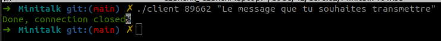

  

# Minitalk

Ce projet consiste à créer un programme client/serveur simple. Les deux programmes ne peuvent communiquer que via les signaux POSIX `SIGUSR1` et `SIGUSR2`.
Le client encode chaque bit du message et utilise `SIGUSR1` pour envoyer des 0 au serveur et `SIGUSR2` pour envoyer des 1. Le serveur accumule les bits reçus et stocke chaque octet reçu dans un tampon temporaire.
Une fois qu'un terminateur nul `\0` a été reçu par le serveur, il imprime le message et renvoie `SIGUSR2` au client pour fermer la communication. Les caractères Unicode sont pris en charge par le client et le serveur.
Vous pouvez trouver le sujet [ici](en.subject.pdf).

# Télécharge et test !

Clone le projet.

```
git clone https://github.com/ugozchi/42_Minitalk.git
cd 42_Minitalk
```

<br>

## Options possibles ⚙️

Ici, vous pouvez utiliser les options classiques d'un Makefile (options ci-dessous) mais aussi l'option bonus qui vous permettra d'ajouter vos fonctions bonus dans votre fichier archive libft.a si vous les avez fait.  
Toute cette partie correspond à ce que l'on doit rendre pour ce faire corriger.

<br>


<br>

| Option | Description |
| --- | --- |
| `make` | Créer un fichier archive libftpritnf.a avec tous les fichiers |
| `make clean` | Supprime le dossier contenant les fichiers objets ```.o```|
| `make fclean` | Execute `clean` puis supprime le fichier archive ```.a```|
| `make re` | Execute `fclean` puis `make` |

<br>

Pour lancer le programme :
- Commence par éxecuter 
```
	./server
```


- Puis éxecute :
```
	./client
```


Une fois le message envoyé il est transmis au server :


<br>
